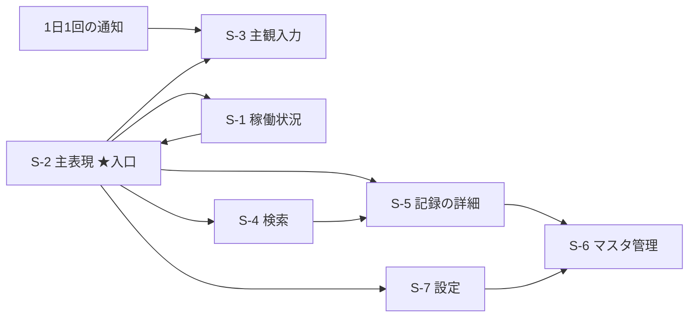

# UI の方向 — あしあと。

> 骨格・主役・表面は `docs/ui-direction-playground.html` を触って選んだ。
> **A（集める）は判断ゼロの節**なので、そこに書いてあることは選択ではなく機械的な収集。

## 画面の一覧

`docs/stories/ST*.md` の「価値」と「完了の判定」から拾った。推測で足した画面は無い。

| 画面 | 主目的 | 出所 Story | 触れる要件 |
|---|---|---|---|
| S-1 稼働状況 | どのソースがいつ動いていたか | ST02, ST04, ST10, ST12, ST15 | FR-54, FR-55, FR-9, FR-34 |
| S-2 主表現（1 日を見る） | ある 1 日に何をしていたか | ST25, ST16, ST17 | FR-56, FR-76, FR-57 |
| S-3 主観入力 | その日どう感じたか | ST17 | FR-36〜FR-43 |
| S-4 検索 | 語で引く | ST26, ST36 | FR-58, FR-75 |
| S-5 記録の詳細 | 1 件を見る・消す | ST22, ST23 | FR-50, FR-51, FR-52 |
| S-6 マスタ管理 | 場所・人物・個人属性に名前を付ける | ST19, ST20, ST21 | FR-44〜FR-49 |
| S-7 設定 | ソース・停止・感度・プラグイン・書き出し | ST13, ST15, ST24, ST29, ST33 | FR-53, FR-15, PERM-2〜9, FR-62〜65, NFR-16 |

**面を持たない Story（17 本）**: ST01, ST03, ST05, ST06, ST07, ST08, ST09, ST18, ST27, ST28,
ST30, ST31, ST34, ST35（裏方・収集系）/ ST11（OS の権限ダイアログで自前の画面ではない）/
ST14, ST32（OS 通知）。

## つながり



どこからも行けない画面は無く、入口からの最大の深さは 2。

## 満たす下限（要件から抜いたもの。出所つき）

| 下限・禁止 | 出所 |
|---|---|
| OS の明暗設定に追従する（取得できない場合はダーク） | **NFR-17** ← 本人の一次発話 RT01 |
| 本文と背景のコントラスト比 4.5:1 以上（大きい文字は 3:1 以上） | **NFR-18** ← WCAG 2.2 SC 1.4.3 / Level AA（EXT-F） |
| 指で触れる対象は 24×24 CSS px 以上 | **NFR-19** ← WCAG 2.2 SC 2.5.8 / Level AA（EXT-G） |
| 取り返しの付かない操作（FR-51 / FR-53）は 44×44 CSS px 以上 | **NFR-20** ← WCAG 2.2 SC 2.5.5 / Level AAA（EXT-H） |
| 原色・派手な配色・角張った四角を用いない | **NFR-21** ← 本人の逐語（20260724） |
| キーボードのフォーカス位置が見える | **NFR-22** ← WCAG 2.2 SC 2.4.7 / Level AA（EXT-I）。**C-4 のレビューが見つけた抜け** |

いずれも playground のコントロールにしていない。全状態が満たす前提として固定し、画面上に明示している。

**NFR-21 だけは要件が数値を持たない**（本人が数値で言っていないため）。したがって
**彩度 55% 上限・角 4px 下限はこの工程が置いた運用値**であり、要件ではない。playground 上でも
そう明示している。

## 密度を判断するための件数

| 単位 | 件数 | 根拠 |
|---|---|---|
| 生の記録 | 1 日 約 4,120 件 | 位置 1,440（FR-1 の 60 秒間隔）+ 心拍 1,440（Should）+ ウィンドウ変化 500〜2,000（FR-12）+ ブラウザ履歴 数十〜数百（FR-13）+ 写真 約 5.5（NFR-6 の年 2,000 枚）+ 主観 1（FR-36） |
| 滞在 | 1 日 5〜15 件 | FR-76（半径 100 m / 10 分） |
| 日 | 1 か月 30 件 | — |
| 詳細の階層 | 入口から最大 2 | 上の mermaid |

**この 3 つの単位のどれを 1 行にするかで、1 画面に並ぶ件数が 3 桁変わる。** だから
「1 行の単位」を playground の骨格の軸に置いている。

## 要件へ戻した抜け

2026-09-08、`docs/requirements.md` に **NFR-17〜21** と外部世界の主張 **EXT-F / EXT-G / EXT-H** を追加した。

**戻す前に出所を検算したところ、旧プロジェクトの記録が誤っていた。**
旧 ashiato の `traceability.md` は旧 NFR-15/16/17 の出所を「本人 / `data/interviews/20260829_113051_deep.json`」と
記録しているが、**この JSON は本人へのインタビューではない**。`exchanges` の構造は
`{area, question, answer, confidence}` で `answer` は AI の散文であり、当の項目に

> 本人専用ツールなので下限は緩められるが、線を引かないと実装が無所有のデフォルトテーマを引くため
> **仮の線を置く** … 仮の線として提案し合意を取った形なので **confidence: low**

と書かれている。つまり旧要件の「コントラスト 4.5:1 / タップ 44×44 / 本文 14px」は
**AI の仮置きであって本人の発話ではない**。

そのため今回は次のように分けた。

- **本人の発話に紐づくもの** → NFR-17（RT01）、NFR-21（20260724 の逐語）
- **規格の条項に紐づくもの** → NFR-18（SC 1.4.3）、NFR-19（SC 2.5.8）、NFR-20（SC 2.5.5）
- **AA と AAA のどちらを採るかは誰も決めていなかった** → 本人が 2026-09-08 に決定（AA で揃え、
  取り返しの付かない操作だけ AAA）
- **本文 14px の下限は戻さなかった。** 本人の発話にも規格の条項にも紐づかず、
  根拠が「AI の仮置き」しか無いため。文字の大きさは playground の軸として扱う

## 決めた方向

**playground の prompt 出力（逐語。手を入れていない）**:

```
あしあと。の全画面は次の方向で作る。

骨格 — 時系列を主表現にし、リストで並べ、1 行の単位は「滞在」。
詳細はその場で開く（画面を移らない）。
単位を「滞在」にしたので 1 画面に並ぶのは 9 件。

表面 — 色相 132°・彩度 30%・地の深さ 12（深い）・面 3 段、
角は半径 15px、本文 16.1px / 行間 1.65、
区切りは境界線、種類のしるしは付けない。
既定から動かしたのは 見出しと本文の差は ほどよく（比 1.15）、密度はかなりゆったり（間隔 24px）、色相は 132°、彩度は 30%（低く抑える）、地は深く沈める（12）、面は 3 段、角は半径 15px でほどよく丸め、区切りは境界線で引く。

守る下限（動かさない）: OS の明暗に追従（NFR-17。ライトでもダークでも成立させる）/
本文のコントラスト 4.5:1 以上（NFR-18。いまダークで最小 4.5:1）/ 触れる対象 24×24px 以上（NFR-19）/
削除・停止だけ 44×44px 以上（NFR-20）/ 原色と角張りを避ける（NFR-21）。

これは全画面が従う方向であって、各画面のレイアウトではない。レイアウトは Story ごとに決める。
実装技術はまだ決めていないので、フレームワーク固有の書き方はここに含めない。
```

**そこに決めた理由（本人の言葉）**: 「落ち着いていてゆったりと見れる感じなので」

### この出力を読むときの注意（3 点）

1. **「地の深さ 12」は、その後の版で「地の明るさ 12」に改名した軸と同じもの。** 値は同じ。
   `ui-review` の指摘（値を上げると浅くなるので軸名と向きが逆）で改名した
2. **下限の列挙に NFR-22（フォーカスの可視 / WCAG 2.2 SC 2.4.7）が入っていない。**
   この出力を取った後にレビューが見つけて要件へ戻したため。**NFR-22 も等しく守る**
3. **色相 132° は緑（苔）の方向で、本人が 2026-07-24 に挙げた形容詞「暖かい」とは違う側。**
   実物を触って選んだ結果なので**そのまま採る**。下流で「暖かい＝琥珀」に読み替え直さないこと

## 軸と選んだ値

| 群 | 軸 | 型 | 選んだ値 |
|---|---|---|---|
| 骨格 | 主表現（時系列 / カレンダー / 地図 / 一覧） | Clickable cards | **時系列** |
| 骨格 | 並べ方（リスト / カード / 表） | Clickable cards | **リスト** |
| 骨格 | 1 行の単位（生の記録 / 滞在 / 日） | Clickable cards | **滞在**（1 画面 9 件） |
| 骨格 | 詳細の降り方（その場 / 画面遷移） | Clickable cards | **その場で開く** |
| 主役 | 何を大きく出すか（場所名 / 時刻と長さ / 写真 / 気分） | Dropdown | **場所の名前**（既定のまま） |
| 主役 | 情報階層（Typography scale の ratio） | Slider 1.00–1.50 | **1.15** |
| 主役 | 情報密度（比例スケール 1 本） | Slider 0–100 | **75**（間隔 24px / 本文 16.1px） |
| 表面・色 | 色相 | Slider 0–359 | **132°** |
| 表面・色 | 彩度 | Slider 4–55 | **30%** |
| 表面・色 | 地の明るさ | Slider 0–100 | **12**（沈んだ側） |
| 表面・色 | 面の段数（surface 導出） | Slider 1–4 | **3 段** |
| 表面・形 | 角の丸み | Slider 4–28 | **15px** |
| 表面・形 | 本文の大きさ | Slider 12–20 | **15px**（密度を掛けた実寸 16.1px） |
| 表面・形 | 行間 | Slider 1.45–2.10 | **1.65** |
| 表面・形 | 境界線で区切るか | Toggle | **引く** |
| 表面・形 | 種類にしるしを付けるか | Toggle | **付けない** |

### この確定値から出る帰結（Story の深掘りへ持ち越す 3 件）

要件（NFR-17〜22）はこの設定で**すべて満たしている**（実測の最小コントラストは
ダーク 4.58:1 / ライト 4.71:1、行の高さ 46.0px、削除操作 44×44、フォーカスリングは地に対し
8.2〜10.3:1）。そのうえで、決めた内容そのものから出てくる宿題が 3 つある。

1. **「しるしを付けない」を選んだので、種類の区別が色だけになる。** しかも 6 色は等明度・等彩度
   （色相 52°/84°/116°/148°/180°/212°）で、輝度差は最小 1.009:1 —— グレースケールと 2 型色覚では
   区別できない。**「出てきたら足す」ではなく、確定した 3 画面のうち稼働状況が既にソースを
   色で分けている。** 行にはソース名の文字があるので情報は失われないが、
   **色を意味の担い手にする箇所には形かラベルを併せる**こと（ST02 / ST25 の深掘りで決める）

   > **★ 2026-09-10 決着（ST02 の深掘り 第 4 回 Q15）—— ソースごとに分け、
   > ソース名の文字を添える。**（★ 2026-09-11 訂正: 当初は「ソースごとに**行**を分け、
   > **行頭**に」と書いたが、第 6 回 Q25 で格子が**縦長**になり、
   > **行は週**を指すことになった。ソースは行ではなく**格子**で分かれる。） この宿題が自ら示していた解そのもので、
   > **色は意味の担い手にならない**。ST02 の稼働状況（S-1）はこの形で作る。
   >
   > **決着の途中で 1 度誤った読み替えをして、取り消している。** ST02 の深掘りは当初
   > 「稼働の状態に明度の段差を割り当てたので宿題 1 は解けた」と書いたが、
   > **1.009:1 は「ソースを分ける 6 色」の輝度差**であって、稼働の状態の色ではない
   > （状態という概念は ST02 の深掘りで初めて生まれた）。
   > 状態に明度を割り当ててもソースの色の 1.009:1 は解けない。`review/deep.md` の R10 で取り消した。
   >
   > **ST25（S-2 主表現）側の宿題は残っている** —— 記録の種類を 6 色で分ける箇所は
   > ST02 の対象外で、そこに文字を併せるかは ST25 の深掘りで決める。
   >
   > **★ 2026-09-11 追記: 状態の側に別の穴が見つかった。** 稼働の 7 状態を
   > 「明度の段差だけ」で区別する案は、**WCAG SC 1.4.11（隣接する色に 3:1）では成り立たない**
   > —— 隣接 3:1 を 6 区間ぶん積むと 3^6 = 729:1 が要るのに、sRGB の理論最大は 21:1。
   > 21:1 を 6 等分しても隣接 1.661:1 にしかならない。
   >
   > **★ 2026-09-11 決着（ST02 の深掘り 第 5 回 Q21）—— 格子が担う区別を 3 段に畳み、
   > 7 状態の区別は週を選んだときの文字で読む。** 3 段なら 3:1 × 3:1 = 9:1 で収まる。
   > **これで宿題 1 は状態の側でも閉じた** —— 「形かラベルを併せる」の**ラベル**が、
   > ソースの側では各格子に添えたソース名（Q15）、状態の側では週を選んだときの状態名（Q21）にあたる。
   > 併せて **NFR-23（意味を担う非テキストは 3:1 以上。WCAG SC 1.4.11 / EXT-J）を新設した** ——
   > この基準を根拠に選んだのに、要件の側に対応する行が無かった。
2. **要件上限の 15 件（FR-76 の滞在は 1 日 5〜15 件）は、スマホ幅では 1 画面に収まらない**
   （約 833px）。通常の 9 件は 557px で収まり、幅 900px 以上なら 2 列で 511px に収まる。
   **「1 画面に収まる」は通常時の話であって、上限時の保証ではない**
   > **★ 2026-09-13 補足（ST16 の深掘り Q4）—— S-2 の 1 行は、主観と人物の本文を行の中に出す。**
   > ST16 の proto（`openspec/changes/st16-stay-derivation/proto.html`）で本人が選んだ。
   > 1 日 1,440 件の位置から滞在を実際に計算して積んだ実測で、**いちばん高い行は 171 px、
   > 幅 360 px の 1 画面（720 px）に入るのは 6 行**（移動の行と「記録なし」の行を含む）。
   > **上の「通常の 9 件は 557 px で収まる」は、この行の形では成り立たない。** 本人は実測の値を見たうえで選んでいる。
   > ST16 の時点で本文に出すものは無い（主観は ST17、人物は ST20）ので、**置き場を作るのは ST17 / ST20**。
   > 同時に決まった S-2 の構造: 行の見出しは**時刻の範囲**（場所の登録は ST21 で、ST16 の時点では名前が無い）/
   > 滞在と滞在の間に「移動 42 分」の行 / 位置の記録が無い時間に「記録なし 8:20–16:40」の行
   > （移動と同じ顔にしない。扉 #14）/ 一覧に「作り直した基準」を出す
3. **逐語 prompt に「主役＝場所の名前」が書かれていない。** 既定値と一致する軸は差分に出ない
   仕様のため。**上の表が正典**（playground は主役を必ず書くよう直した）

**文脈（軸ではない。同じ設定のまま切り替えて両方成立するかを見るもの）**:
ライト ⇄ ダーク / 幅 360〜1440px / 画面 3 枚（主表現・検索結果・稼働状況）。

**presets（性格。軸にしない）**: 落ち着いた / のんびり / 見渡す / 地図から / 暦から。

## 決めなかったこと

- **アイコンの体系・イラスト・アニメーション** — 方向を決めるのに要らず、Story ごとの深掘りで足りる
- **色のトークン値の確定** — 実装技術が `/production-prep` でまだ決まっていないため、
  ここで値まで落とすと技術依存の形で固まる
- **各画面のレスポンシブの閾値** — 幅は文脈として触って確かめるが、画面ごとの閾値は中身で決まるので
  ここでは決めない。**ただし playground が 900px で 2 段組に切り替えるのは、幅を動かす意味を作るための
  この工程の運用値**であり、製品の閾値として決めたものではない（開示欄に明記した）
- **フォーカス表示の見た目** — 「見えること」は NFR-22 が要件として持つが、線幅・色・形は決めない
- **印刷・共有の見た目** — 要件に該当する FR が無い
- **主観入力（S-3）の細かい入力手順** — FR-36〜43 が定めるのは列と通知で、手順は Story の担当

## レビューの結果

`ui-review` subagent を独立に **4 回**起動した（自分では点検していない）。全文は
`docs/reviews/ui-direction_review.md`。**第 1 回 37 + 第 2 回 10 + 第 3 回 13 + 第 4 回 10 = 70 件**。

### 直した（63 件）

とくに重かったもの:

| 指摘 | 何が起きていたか | 直し方 |
|---|---|---|
| UIR-13 / UIR-38 | **NFR-18 が既定状態で割れていた。** 気分チップの文字が 3.99:1。しかも `pal()` が測る色（`hsl(h, s*0.3, …)`）と実際に描く色（`hsl(accHue(h,3,m), s*0.7, …)`）が色相 ±50°・彩度 2.33 倍ずれており、全状態の 23.4% が 4.5 未満だった | **文字が実際に乗る背景を「描くときと同じ色」で 7 つ列挙**し、その全部に対して 4.5:1 を満たす文字色を探すよう変更。独立に検算して **12,672 通りで違反 0 件・最小 4.50:1** |
| UIR-1 / UIR-49 | 「地の明るさ」の可動域が明度 4〜20% しかなく、振っても実質変わらなかった | 帯いっぱいまで拡大。**面の段数が可動域を食うので段数ごとに違う** —— ダークで 1 段 3〜34% / 2 段 3〜31% / **3 段（確定値）3〜28%** / 4 段 3〜25% |
| UIR-39 / UIR-40 | UIR-1 を直した副作用で、深さを上げると「面の段数」が動かなくなっていた | 段数ぶんの余地（最小 3pt × (段数-1)）を先に確保してから明るさを配分。上端でも段差 3.0pt を保つ |
| UIR-20 | 検索結果と稼働状況の 2 画面が、骨格・主役・しるしの軸を一切読んでいなかった | 検索を共通の行描画に通し、稼働状況にしるしを反映 |
| UIR-23 | 種類の色の本数が「面の段数」に従属しており、**同じ種類が画面ごとに別色**になっていた | 色の本数を面の段数から切り離して固定 |
| UIR-30 / UIR-43 | 「色だけに頼らない」トグルが**同じ色の無地の四角**で、色だけの区別が解消していなかった | 種類ごとに形を変え、地図のピンにも適用 |
| UIR-16 | 地図のピンが 9 個中 7 個で 24px 未満（**NFR-19 違反**） | 24px を下限に |
| UIR-18 / UIR-44 | **要件に無い閾値を自前で立てていた**（5.5:1 / 3.0:1 / 文字彩度 15% / 800px ほか） | 消さずに、左パネルへ「**この工程の運用値（要件ではない）**」として全部開示 |
| UIR-5 / UIR-6 / UIR-29 | 骨格の組み合わせ 576 通りのうち 293 通りが**別の組み合わせと同じ絵**になり、しかも一度も描かれていない組み合わせが prompt に書けてしまっていた | 表でも降り方が効くように実装。カレンダーで効かない軸は**画面上で無効表示にし、prompt からも落とす**（「この主表現では決まらない」と明記） |
| UIR-32 / UIR-46 / UIR-47 | 空・エラー・読み込み中・最長ケースが 1 つも無かった | 文脈に「状態」を追加（通常 / 最長・最多 / 読み込み中 / 空 / 取得エラー） |
| UIR-9 / UIR-8 / UIR-21 | 幅を動かしても何も変わらず、はみ出しは `overflow:hidden` で隠れていた | 900px 以上で 2 段組にする規則を持たせ、はみ出しは隠さず出す。実効幅を併記 |

残り（UIR-2, 3, 7, 10, 11, 15, 17, 22, 24, 26, 27, 28, 31, 33, 34, 37, 41, 42, 45, 48〜59）も同様に反映済み。

### 第 3 回で、私の記録の誤りが 1 件見つかった（UIR-60）

第 2 回のあと、**UIR-40（面の段数が既定の 2 段では `s1 = s2 = s3` になり、写真枠と展開ブロックが
カード地と同色）を「直した」と書いたが、実際には直っていなかった。** `--s3` を出力しただけで
`L(i)` を変えていなかったため、症状が別の変数へ移っただけだった。

第 3 回で、写真枠と展開ブロックを**面の段数から独立した色（`--sub`）**に変え、さらに帯の上端では
逆向きに逃がすようにして解消した（clamp すると端でカードと同色に戻る、という二段目の穴があった）。
検算: card と `--sub` のコントラスト差は全 12,672 通りで最小 1.065:1（同色になる状態は無い）。

### 直さない（3 件）

| 指摘 | 理由 |
|---|---|
| UIR-4 「並べ方＝カード」が既定ではリストとほぼ同じ絵 | **面の明度差ではカードを主張させない、と決めた。** レビューの検算どおり `card/s0` の最大は 1.381:1 で、NFR-18 の帯を守る限りこれ以上は開かない（密度は色に影響しない）。**カードとリストの差は余白・角丸・境界線で出す**。第 2 回に書いた「密度を上げれば差が出る」は事実として誤りだったので取り消す |
| UIR-12 色相スライダのトラックが固定の虹色 | playground **自身の chrome** であって、決める対象（あしあと。の画面）ではない |
| UIR-36 playground 自身の配色が 3.87:1 | 同上。**playground は成果物ではなく道具**。製品側の同じ問題は NFR-18 が受ける |

### 直さないと書いたが、指摘が正しかったので撤回して直した（3 件）

| 指摘 | 何が誤りだったか |
|---|---|
| UIR-35 フォーカスの可視化 | 「NFR-18 / NFR-19 が受ける」は**成立しない**。フォーカスの可視は WCAG 2.2 SC 2.4.7 で、1.4.3 とも 2.5.8 とも別条項。**要件の抜けだったので NFR-22 として要件へ戻した**（C-2 と同じ扱い）。playground 側にも `:focus-visible` を入れた |
| UIR-25 日本語の行間 | 「preset が下限に触れる義務は無い」と書いたが**読み違え**で、preset「見渡す」が実際に 1.38 を本文 11.8px で使っていた。行間の下限を 1.45 に上げ、preset を 1.52 にした |
| UIR-19 「収まる」を部分データで測る | 「全件描画は非現実的」は `raw`（1 日 4,120 件）にしか当てはまらず、`day`（30 件）には当てはまらない。判定が目安である点は変えないが、理由は取り消す |

### 第 4 回 —— 同じ型の割れが 3 度目に出た（UIR-61）

**`--sub`（写真枠・展開ブロック・読み込み中の骨組みの色）が、コントラストの走査対象に入っていなかった。**
`sub` を計算する行が走査を組み立てる行より下にあっただけで、結果として全状態の 6.9%（869 通り）で
展開ブロックの文字が 4.5:1 を割っていた（最小 3.47:1）。**UIR-14 → UIR-38 → UIR-61 と 3 度、
同じ「列挙する場所と描く場所が別々」から出ている。**

そこで値を 1 つずつ足すのをやめ、**面を 1 つの表（`tones`）に集約して、走査対象も CSS 変数も
その表から生成する**形にした。以後、面を足しても走査から漏れない。
検算: 12,672 通りで違反 0・最小 4.50:1。レビューの再現ケース（既定＋明るさ 60）は 3.61 → 4.50:1。
第 5 回でさらに、チップの実色を作る口を 1 か所に寄せ（彩度係数が 2 か所にあり片方だけ変えると
再発する状態だった）、走査対象は **面 6 + チップ 3 の 9 組**になった。

あわせて第 4 回で直したもの: 表の縞が 2 列グリッドで縦縞になる件（DOM の位置ではなく行番号で塗る）/
展開ブロックが表のセルからはみ出る件 / 地図と稼働状況に 2 列が効かない件 /
**NFR-22 が画面にも prompt にも出ていなかった件**（パネルと下限リストに追加し、
プレビューの行と削除操作を Tab で辿れるようにして `:focus-visible` が実際に発火するようにした）/
開示欄の「面の最小差 4pt」が実装の 3pt とずれていた件。

**指摘は 1 件も黙って捨てていない。** 70 件のうち直した 63 / 直さない 3 / 撤回して直した 3 /
第 4 回の判定待ち 1（`.cols` をカレンダーに入れない件は、カレンダー自体が既に格子なので入れない）。

> **確定した設定（色相 132° / 彩度 30% / 明るさ 12 / 3 段）は、どの版でも NFR-18 を割っていない**
> （ダーク 4.58:1 / ライト 4.57:1）。上記の割れはいずれも、確定値とは別の組み合わせで起きていた。
